# Submission Score 
#### (**Top 27%**)
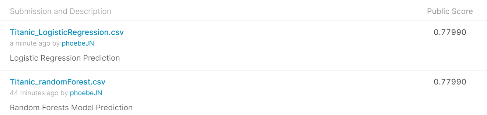

## Loading relevant packages


```r
library(ggplot2)
library(dplyr)
```

```
## 
## Attaching package: 'dplyr'
```

```
## The following objects are masked from 'package:stats':
## 
##     filter, lag
```

```
## The following objects are masked from 'package:base':
## 
##     intersect, setdiff, setequal, union
```

```r
library(tidyr)
library(reshape2)
```

```
## 
## Attaching package: 'reshape2'
```

```
## The following object is masked from 'package:tidyr':
## 
##     smiths
```

```r
library(randomForest)
```

```
## randomForest 4.6-14
```

```
## Type rfNews() to see new features/changes/bug fixes.
```

```
## 
## Attaching package: 'randomForest'
```

```
## The following object is masked from 'package:dplyr':
## 
##     combine
```

```
## The following object is masked from 'package:ggplot2':
## 
##     margin
```

## Reading in the dataset


```r
Titanic.train <- read.csv("datasets/train.csv", stringsAsFactors = FALSE)
Titanic.test <- read.csv("datasets/test.csv", stringsAsFactors = FALSE)
Titanic.full <- bind_rows(Titanic.train, Titanic.test) # `bind_rows` returns the same type as the first input
```

## Cleaning up the data

**Predictive variables**

* `PssengerId`: a passenger's ID

* `Pclass`: passenger Class (1 = 1st; 2 = 2nd; 3 = 3rd)

* `Name`: name of a passenger 

* `Sex`: sex of a passenger

* `Age`: age of a passenger

* `Sibsp`: number of siblings/spouses aboard of a passenger

* `Parch`: number of parents/children Aboard of a passenger

* `Ticket`: ticket number of a passenger

* `Fare`: passenger fare

* `Cabin`: cabin number

* `Embarked`: port of embarkation (C = Cherbourg; Q = Queenstown; S = Southampton)

**Response variable**

* `Survival`: a passenger whether is survival or not (0 = No; 1 = Yes)


```r
# get a glimpse of the data
glimpse(Titanic.full)
```

```
## Rows: 1,309
## Columns: 12
## $ PassengerId <int> 1, 2, 3, 4, 5, 6, 7, 8, 9, 10, 11, 12, 13, 14, 15, 16, ...
## $ Survived    <int> 0, 1, 1, 1, 0, 0, 0, 0, 1, 1, 1, 1, 0, 0, 0, 1, 0, 1, 0...
## $ Pclass      <int> 3, 1, 3, 1, 3, 3, 1, 3, 3, 2, 3, 1, 3, 3, 3, 2, 3, 2, 3...
## $ Name        <chr> "Braund, Mr. Owen Harris", "Cumings, Mrs. John Bradley ...
## $ Sex         <chr> "male", "female", "female", "female", "male", "male", "...
## $ Age         <dbl> 22, 38, 26, 35, 35, NA, 54, 2, 27, 14, 4, 58, 20, 39, 1...
## $ SibSp       <int> 1, 1, 0, 1, 0, 0, 0, 3, 0, 1, 1, 0, 0, 1, 0, 0, 4, 0, 1...
## $ Parch       <int> 0, 0, 0, 0, 0, 0, 0, 1, 2, 0, 1, 0, 0, 5, 0, 0, 1, 0, 0...
## $ Ticket      <chr> "A/5 21171", "PC 17599", "STON/O2. 3101282", "113803", ...
## $ Fare        <dbl> 7.2500, 71.2833, 7.9250, 53.1000, 8.0500, 8.4583, 51.86...
## $ Cabin       <chr> "", "C85", "", "C123", "", "", "E46", "", "", "", "G6",...
## $ Embarked    <chr> "S", "C", "S", "S", "S", "Q", "S", "S", "S", "C", "S", ...
```

```r
# factor `Survived`
Titanic.full$Survived <- as.factor(Titanic.full$Survived)
Titanic.full$Pclass <- as.factor(Titanic.full$Pclass)
Titanic.full$Embarked <- as.factor(Titanic.full$Embarked)

# missing values
table(is.na(Titanic.full)) # 682 NAs
```

```
## 
## FALSE  TRUE 
## 15026   682
```

```r
colSums(is.na(Titanic.full)) # NA counts for each column 
```

```
## PassengerId    Survived      Pclass        Name         Sex         Age 
##           0         418           0           0           0         263 
##       SibSp       Parch      Ticket        Fare       Cabin    Embarked 
##           0           0           0           1           0           0
```

```r
colSums(Titanic.full == "") # NULL counts for each column 
```

```
## PassengerId    Survived      Pclass        Name         Sex         Age 
##           0          NA           0           0           0          NA 
##       SibSp       Parch      Ticket        Fare       Cabin    Embarked 
##           0           0           0          NA        1014           2
```

```r
# dealing with missing values (`Age`, `Fare`, `Cabin`, `Embarked`columns have missing values)

# `Embarked`
table(Titanic.full$Embarked) # Most common is `S`
```

```
## 
##       C   Q   S 
##   2 270 123 914
```

```r
Titanic.full$Embarked[Titanic.full$Embarked == ""] <- "S"

# 'Fare`
Titanic.full[is.na(Titanic.full$Fare), ] # find out the detail info of the missing fare value
```

```
##      PassengerId Survived Pclass               Name  Sex  Age SibSp Parch
## 1044        1044     <NA>      3 Storey, Mr. Thomas male 60.5     0     0
##      Ticket Fare Cabin Embarked
## 1044   3701   NA              S
```

```r
Titanic.full %>%
  select(Pclass, Fare) %>%
  group_by(Pclass) %>%
  summarise(median_fare = median(Fare, na.rm = TRUE)) # `Fare` is related to `Pclass`
```

```
## # A tibble: 3 x 2
##   Pclass median_fare
## * <fct>        <dbl>
## 1 1            60   
## 2 2            15.0 
## 3 3             8.05
```

```r
Titanic.full$Fare[Titanic.full$PassengerId == 1044] <- 8.05 # fill the median fare of 'Pclass` 3

# `Cabin`
# Since the total number of missing values in this column is 1014 and the missing rate is approximately 77%, there is no much information to contribute to this analysis. 
# Therefore, I will not use the `Cabin` as a predictive variable in my model. (Drop `Cabin`)
1014/1309
```

```
## [1] 0.7746371
```

```r
Titanic.full$Cabin <- NULL

# 'Age'
Titanic.full %>%
  select(Sex, Age) %>%
  group_by(Sex) %>%
  summarise(median_age = median(Age, na.rm = TRUE)) 
```

```
## # A tibble: 2 x 2
##   Sex    median_age
## * <chr>       <dbl>
## 1 female         27
## 2 male           28
```

```r
Titanic.full[Titanic.full$Sex == "female" & is.na(Titanic.full$Age), c("Age")] <- 27 # fill the median female age for missing age of female

Titanic.full[Titanic.full$Sex == "male" & is.na(Titanic.full$Age), c("Age")] <- 28 # fill the median male age for missing age of male

# Drop 'Ticket`
length(unique(Titanic.full$Ticket))
```

```
## [1] 929
```

```r
Titanic.full$Ticket <- NULL

# scale the data
summary(Titanic.full)[, -1]
```

```
##  Survived   Pclass      Name               Sex                 Age       
##  0   :549   1:323   Length:1309        Length:1309        Min.   : 0.17  
##  1   :342   2:277   Class :character   Class :character   1st Qu.:22.00  
##  NA's:418   3:709   Mode  :character   Mode  :character   Median :28.00  
##                                                           Mean   :29.44  
##                                                           3rd Qu.:35.00  
##                                                           Max.   :80.00  
##      SibSp            Parch            Fare         Embarked
##  Min.   :0.0000   Min.   :0.000   Min.   :  0.000    :  0   
##  1st Qu.:0.0000   1st Qu.:0.000   1st Qu.:  7.896   C:270   
##  Median :0.0000   Median :0.000   Median : 14.454   Q:123   
##  Mean   :0.4989   Mean   :0.385   Mean   : 33.276   S:916   
##  3rd Qu.:1.0000   3rd Qu.:0.000   3rd Qu.: 31.275           
##  Max.   :8.0000   Max.   :9.000   Max.   :512.329
```

```r
Titanic.full$Age.scaled <- scale(Titanic.full$Age)
Titanic.full$SibSp.scaled <- scale(Titanic.full$SibSp)
Titanic.full$Parch.scaled <- scale(Titanic.full$Parch)
Titanic.full$Fare.scaled <- scale(Titanic.full$Fare)

# Look the summary after continuous variables are scaled
summary(Titanic.full)[, -1]
```

```
##  Survived   Pclass      Name               Sex                 Age       
##  0   :549   1:323   Length:1309        Length:1309        Min.   : 0.17  
##  1   :342   2:277   Class :character   Class :character   1st Qu.:22.00  
##  NA's:418   3:709   Mode  :character   Mode  :character   Median :28.00  
##                                                           Mean   :29.44  
##                                                           3rd Qu.:35.00  
##                                                           Max.   :80.00  
##      SibSp            Parch            Fare         Embarked
##  Min.   :0.0000   Min.   :0.000   Min.   :  0.000    :  0   
##  1st Qu.:0.0000   1st Qu.:0.000   1st Qu.:  7.896   C:270   
##  Median :0.0000   Median :0.000   Median : 14.454   Q:123   
##  Mean   :0.4989   Mean   :0.385   Mean   : 33.276   S:916   
##  3rd Qu.:1.0000   3rd Qu.:0.000   3rd Qu.: 31.275           
##  Max.   :8.0000   Max.   :9.000   Max.   :512.329           
##     Age.scaled.V1      SibSp.scaled.V1     Parch.scaled.V1  
##  Min.   :-2.266749   Min.   :-0.478904   Min.   :-0.444829  
##  1st Qu.:-0.576382   1st Qu.:-0.478904   1st Qu.:-0.444829  
##  Median :-0.111782   Median :-0.478904   Median :-0.444829  
##  Mean   : 0.000000   Mean   : 0.000000   Mean   : 0.000000  
##  3rd Qu.: 0.430250   3rd Qu.: 0.481104   3rd Qu.:-0.444829  
##  Max.   : 3.914744   Max.   : 7.201157   Max.   : 9.953060  
##    Fare.scaled.V1   
##  Min.   :-0.643098  
##  1st Qu.:-0.490503  
##  Median :-0.363755  
##  Mean   : 0.000000  
##  3rd Qu.:-0.038675  
##  Max.   : 9.258211
```


## Exploratory Data Analysis (EDA)

```r
Titanic.full[1:891,] %>%
  group_by(Survived, Sex) %>%
  count() %>%
  pivot_wider(
    names_from = Survived,
    values_from = n,
  )
```

```
## # A tibble: 2 x 3
## # Groups:   Sex [2]
##   Sex      `0`   `1`
##   <chr>  <int> <int>
## 1 female    81   233
## 2 male     468   109
```

```r
ggplot(Titanic.full[1:891,], aes(x = Sex, fill = Survived)) +
         geom_bar(position = "fill") +
         ggtitle("The Relationship between Sex and Survival") +
         ylab("Frequency")
```

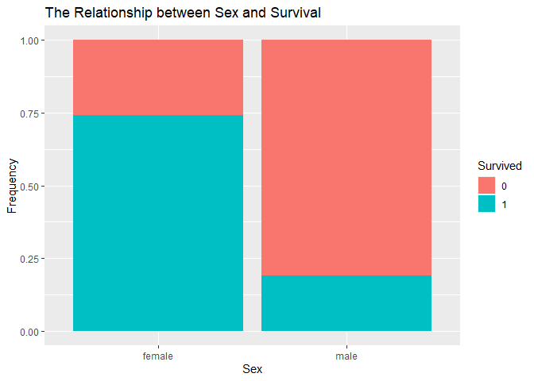<!-- -->

```r
Titanic.full[1:891,] %>%
  group_by(Survived, Pclass) %>%
  count() %>%
    pivot_wider(
    names_from = Survived,
    values_from = n,
  )
```

```
## # A tibble: 3 x 3
## # Groups:   Pclass [3]
##   Pclass   `0`   `1`
##   <fct>  <int> <int>
## 1 1         80   136
## 2 2         97    87
## 3 3        372   119
```

```r
ggplot(Titanic.full[1:891,], aes(x = Pclass, fill = Survived)) +
         geom_bar(position = "fill") +
         ggtitle("The Relationship between Pclass and Survival") +
         ylab("Frequency")
```

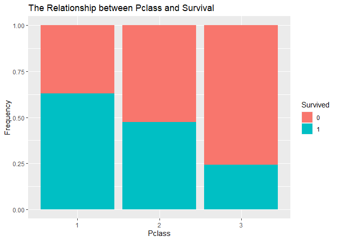<!-- -->

```r
ggplot(Titanic.full[1:891,], aes(x = Pclass, fill = Survived)) +
         geom_bar(position = "fill") +
         facet_wrap(~ Sex) +
         ggtitle("The Relationship between Pclass and Survival by Gender") +
         ylab("Frequency")
```

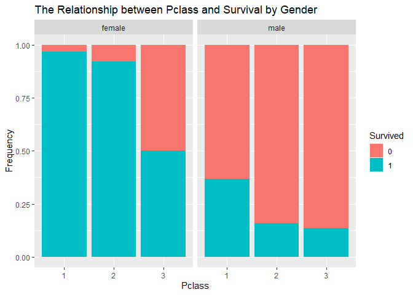<!-- -->

```r
Titanic.full[1:891,] %>%
  group_by(Survived, Embarked) %>%
  count() %>%
    pivot_wider(
    names_from = Survived,
    values_from = n,
  )
```

```
## # A tibble: 3 x 3
## # Groups:   Embarked [3]
##   Embarked   `0`   `1`
##   <fct>    <int> <int>
## 1 C           75    93
## 2 Q           47    30
## 3 S          427   219
```

```r
ggplot(Titanic.full[1:891,], aes(x = Embarked, fill = Survived)) +
         geom_bar(position = "fill") +
         ggtitle("The Relationship between Embarked and Survival") +
         ylab("Frequency")
```

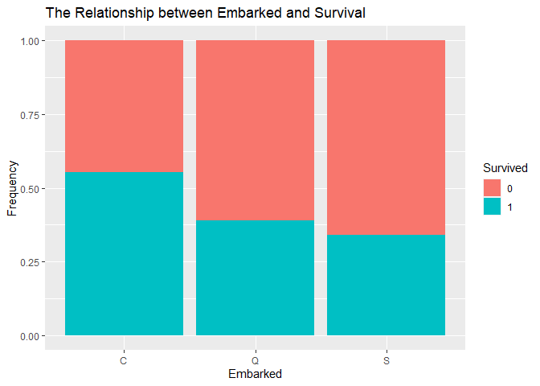<!-- -->

```r
ggplot(Titanic.full[1:891,], aes(x = Embarked, fill = Survived)) +
         geom_bar(position = "fill") +
         facet_wrap(~ Sex) +
         ggtitle("The Relationship between Embarked and Survival by Gender") +
         ylab("Frequency")
```

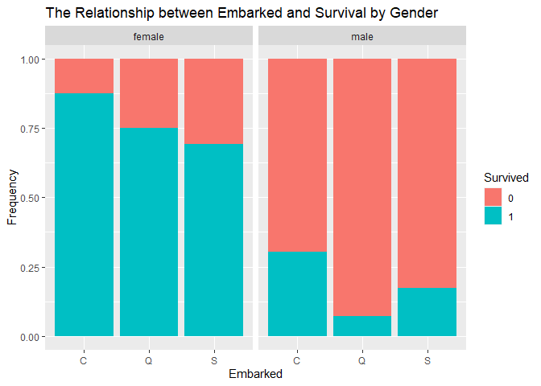<!-- -->

```r
ggplot(Titanic.full[1:891,], aes(x = Age, fill = Survived)) +
         geom_histogram() +
         ggtitle("The Relationship between Age and Survival")
```

```
## `stat_bin()` using `bins = 30`. Pick better value with `binwidth`.
```

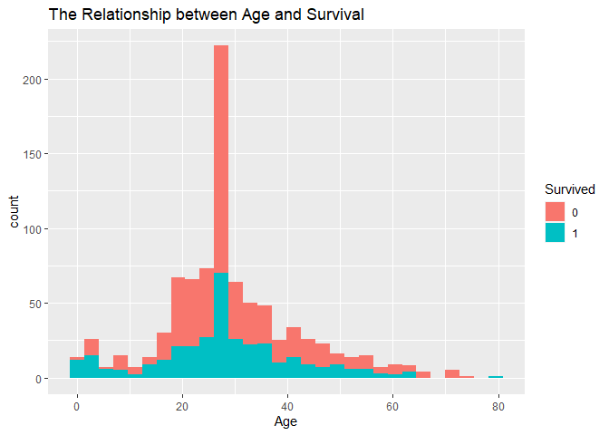<!-- -->

```r
ggplot(Titanic.full[1:891,], aes(x = Parch, fill = Survived)) +
         geom_bar(binwidth =1, position = "fill") +
         ggtitle("The Relationship between Parch and Survival") +
         ylab("Frequency")
```

```
## Warning: Ignoring unknown parameters: binwidth
```

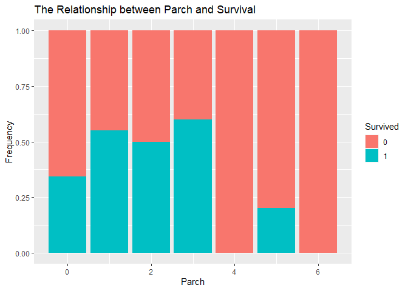<!-- -->

```r
ggplot(Titanic.full[1:891,], aes(x = SibSp, fill = Survived)) +
         geom_bar(binwidth =1, position = "fill") +
         ggtitle("The Relationship between Sibsp and Survival") +
         ylab("Frequency")
```

```
## Warning: Ignoring unknown parameters: binwidth
```

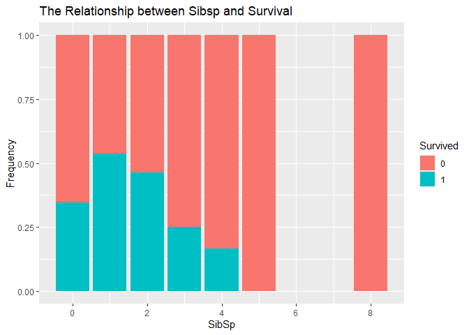<!-- -->

```r
ggplot(Titanic.full[1:891,], aes(x = Fare, fill = Survived)) +
         geom_histogram(position = "fill") +
         ggtitle("The Relationship between Fare and Survival") +
         ylab("Frequency")
```

```
## `stat_bin()` using `bins = 30`. Pick better value with `binwidth`.
```

```
## Warning: Removed 30 rows containing missing values (geom_bar).
```

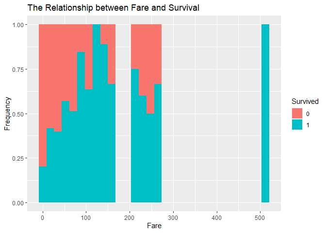<!-- -->

```r
cor <- round(cor(Titanic.full[, 6:9]), 2)
cor
```

```
##         Age SibSp Parch Fare
## Age    1.00 -0.19 -0.13 0.18
## SibSp -0.19  1.00  0.37 0.16
## Parch -0.13  0.37  1.00 0.22
## Fare   0.18  0.16  0.22 1.00
```

```r
# Get upper triangle of the correlation matrix
  get_upper_tri <- function(cormat){
    cormat[lower.tri(cormat)]<- NA
    return(cormat)
  }

upper_tri <- get_upper_tri(cor)
upper_tri
```

```
##       Age SibSp Parch Fare
## Age     1 -0.19 -0.13 0.18
## SibSp  NA  1.00  0.37 0.16
## Parch  NA    NA  1.00 0.22
## Fare   NA    NA    NA 1.00
```

```r
cormat <- melt(upper_tri, na.rm = TRUE)

ggplot(data = cormat, aes(Var2, Var1, fill = value))+
 geom_tile(color = "white")+
 scale_fill_gradient2(low = "black", high = "orange", mid = "white", 
   midpoint = 0, limit = c(-1,1), space = "Lab", 
   name="Pearson\nCorrelation") +
  theme_minimal()+ 
 theme(axis.text.x = element_text(angle = 45, vjust = 1, 
    size = 12, hjust = 1))+
 coord_fixed() +
  ggtitle("The Correlation Matrix (Continuous Variables)")
```

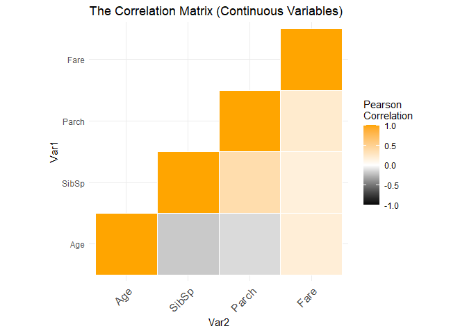<!-- -->

## Building models

```r
set.seed(2)
model_rf <- randomForest(Survived ~ Pclass + Sex + Embarked + Age.scaled + SibSp.scaled + Parch.scaled + Fare.scaled, ntree = 1000, data = Titanic.full[1:891, ], importance = TRUE)

importance(model_rf)
```

```
##                     0          1 MeanDecreaseAccuracy MeanDecreaseGini
## Pclass       25.85582  48.396777             54.10802         33.67727
## Sex          78.57528 117.251837            117.70199        101.76359
## Embarked     13.43512  20.808638             24.60784         12.12295
## Age.scaled   27.89666  39.536662             48.16360         54.46735
## SibSp.scaled 29.72338   4.809083             29.74909         16.20992
## Parch.scaled 17.11759  13.360440             22.14753         13.04505
## Fare.scaled  27.03227  35.748214             46.98123         64.97406
```

```r
varImpPlot(model_rf)
```

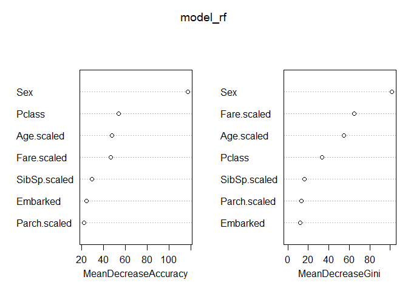<!-- -->


```r
model_lr <- glm(Survived ~ Pclass + Sex + Embarked + Age.scaled + SibSp.scaled + Parch.scaled + Fare.scaled, family = "binomial", data = Titanic.full[1:891, ])
```

## Predicting survival on the Titanic

```r
# randomForest
predict <- predict(model_rf, newdata = Titanic.full[892:1309,])

pred.rf <- data.frame(PassengerId = Titanic.full[892:1309,]$PassengerId, Survived = predict)

write.csv(pred.rf, file = "Titanic_randomForest.csv", row.names = F)

# logistic regression
probs <- predict(model_lr, newdata = Titanic.full[892:1309,], type = "response")
pred.lr <- rep(0, 418)
pred.lr[probs > 0.5] <- 1

pred.lr <- data.frame(PassengerId = Titanic.full[892:1309,]$PassengerId, Survived = pred.lr)

write.csv(pred.rf, file = "Titanic_LogisticRegression.csv", row.names = F)
```


