## Score 
Top 27% 

model rf,rf1: 0.75837

model rf2, rf3: 0.77990

## Table of Contents

[Loading relevant packages](#step1)

[Reading in the dataset](#step2)

[Cleaning up the data](#step3)

[Exploratory Data Analysis (EDA)](#step4)

[Feature Engeneering](#step5)

[Building Models](#step6)

[Predicting survival on the Titanic](#step7)

## Loading relevant packages {#step1}

```r
library(ggplot2)
library(dplyr)
```

```
## 
## Attaching package: 'dplyr'
```

```
## The following objects are masked from 'package:stats':
## 
##     filter, lag
```

```
## The following objects are masked from 'package:base':
## 
##     intersect, setdiff, setequal, union
```

```r
library(tidyr)
library(reshape2)
```

```
## 
## Attaching package: 'reshape2'
```

```
## The following object is masked from 'package:tidyr':
## 
##     smiths
```

```r
library(randomForest)
```

```
## randomForest 4.6-14
```

```
## Type rfNews() to see new features/changes/bug fixes.
```

```
## 
## Attaching package: 'randomForest'
```

```
## The following object is masked from 'package:dplyr':
## 
##     combine
```

```
## The following object is masked from 'package:ggplot2':
## 
##     margin
```

## Reading in the dataset {#step2}

```r
Titanic.train <- read.csv("datasets/train.csv", stringsAsFactors = FALSE)
Titanic.test <- read.csv("datasets/test.csv", stringsAsFactors = FALSE)
Titanic.full <- bind_rows(Titanic.train, Titanic.test) # `bind_rows` returns the same type as the first input
```

## Cleaning up the data {#step3}

**Predictive variables**

`PssengerId`: a passenger’s ID

`Pclass`: passenger Class (1 = 1st; 2 = 2nd; 3 = 3rd)

`Name`: name of a passenger

`Sex`: sex of a passenger

`Age`: age of a passenger

`Sibsp`: number of siblings/spouses aboard of a passenger

`Parch`: number of parents/children Aboard of a passenger

`Ticket`: ticket number of a passenger

`Fare`: passenger fare

`Cabin`: cabin number

`Embarked`: port of embarkation (C = Cherbourg; Q = Queenstown; S = Southampton)

**Response variable**

`Survival`: a passenger

### 1. Get a glimpse of the data


```r
glimpse(Titanic.full)
```

```
## Rows: 1,309
## Columns: 12
## $ PassengerId <int> 1, 2, 3, 4, 5, 6, 7, 8, 9, 10, 11, 12, 13, 14, 15, 16, ...
## $ Survived    <int> 0, 1, 1, 1, 0, 0, 0, 0, 1, 1, 1, 1, 0, 0, 0, 1, 0, 1, 0...
## $ Pclass      <int> 3, 1, 3, 1, 3, 3, 1, 3, 3, 2, 3, 1, 3, 3, 3, 2, 3, 2, 3...
## $ Name        <chr> "Braund, Mr. Owen Harris", "Cumings, Mrs. John Bradley ...
## $ Sex         <chr> "male", "female", "female", "female", "male", "male", "...
## $ Age         <dbl> 22, 38, 26, 35, 35, NA, 54, 2, 27, 14, 4, 58, 20, 39, 1...
## $ SibSp       <int> 1, 1, 0, 1, 0, 0, 0, 3, 0, 1, 1, 0, 0, 1, 0, 0, 4, 0, 1...
## $ Parch       <int> 0, 0, 0, 0, 0, 0, 0, 1, 2, 0, 1, 0, 0, 5, 0, 0, 1, 0, 0...
## $ Ticket      <chr> "A/5 21171", "PC 17599", "STON/O2. 3101282", "113803", ...
## $ Fare        <dbl> 7.2500, 71.2833, 7.9250, 53.1000, 8.0500, 8.4583, 51.86...
## $ Cabin       <chr> "", "C85", "", "C123", "", "", "E46", "", "", "", "G6",...
## $ Embarked    <chr> "S", "C", "S", "S", "S", "Q", "S", "S", "S", "C", "S", ...
```

### 2. Check missing values

`Age` has 263 missing values.

`Fare` has 1 missing values.

`Cabin` has 1014 missing values.

`Embarked` has 2 missing values.

```r
table(is.na(Titanic.full)) # 682 NAs
```

```
## 
## FALSE  TRUE 
## 15026   682
```

```r
colSums(is.na(Titanic.full)) # NA counts for each column 
```

```
## PassengerId    Survived      Pclass        Name         Sex         Age 
##           0         418           0           0           0         263 
##       SibSp       Parch      Ticket        Fare       Cabin    Embarked 
##           0           0           0           1           0           0
```

```r
colSums(Titanic.full == "") # NULL counts for each column 
```

```
## PassengerId    Survived      Pclass        Name         Sex         Age 
##           0          NA           0           0           0          NA 
##       SibSp       Parch      Ticket        Fare       Cabin    Embarked 
##           0           0           0          NA        1014           2
```

### 3. Dealing with missing values

* `Embarked` has 2 missing values.

```r
table(Titanic.full$Embarked) # Most common is `S`
```

```
## 
##       C   Q   S 
##   2 270 123 914
```

```r
Titanic.full$Embarked[Titanic.full$Embarked == ""] <- "S"
```

* `Fare` has 1 missing value.

```r
Titanic.full[is.na(Titanic.full$Fare), ] # find out the detail info of the missing fare value
```

```
##      PassengerId Survived Pclass               Name  Sex  Age SibSp Parch
## 1044        1044       NA      3 Storey, Mr. Thomas male 60.5     0     0
##      Ticket Fare Cabin Embarked
## 1044   3701   NA              S
```

```r
Titanic.full %>%
  select(Pclass, Fare) %>%
  group_by(Pclass) %>%
  summarise(median_fare = median(Fare, na.rm = TRUE)) # `Fare` is related to `Pclass`
```

```
## # A tibble: 3 x 2
##   Pclass median_fare
## *  <int>       <dbl>
## 1      1       60   
## 2      2       15.0 
## 3      3        8.05
```

```r
Titanic.full$Fare[Titanic.full$PassengerId == 1044] <- 8.05 # fill the median fare of 'Pclass` 3
```

* `Age` has 263 missing values.

Look at the `Name` variable, there are different titles that may have relationships with age.

```r
# create a new column named `Title`
Titanic.full$Title <- gsub('(.*, )|(\\..*)', '', Titanic.full$Name)

# count different titles 
table(Titanic.full$Title)
```

```
## 
##         Capt          Col          Don         Dona           Dr     Jonkheer 
##            1            4            1            1            8            1 
##         Lady        Major       Master         Miss         Mlle          Mme 
##            1            2           61          260            2            1 
##           Mr          Mrs           Ms          Rev          Sir the Countess 
##          757          197            2            8            1            1
```

```r
# summary Master age
Titanic.full %>% 
  select(Title, Age) %>% 
  filter(Title == "Master") %>% 
  summarise(max = max(Age, na.rm = T))
```

```
##    max
## 1 14.5
```

```r
# look for girls
Titanic.full %>%
  filter(Sex == "female" & Age <= 14.5) %>%
  select(Title, Age) %>%
  group_by(Title) %>%
  count()
```

```
## # A tibble: 2 x 2
## # Groups:   Title [2]
##   Title     n
##   <chr> <int>
## 1 Miss     50
## 2 Mrs       1
```

```r
# create a new title Girl
Titanic.full$Title[Titanic.full$Title == "Mrs" & Titanic.full$Age <= 14.5] <- "Girl"
Titanic.full$Title[Titanic.full$Title == "Miss" & Titanic.full$Age <= 14.5] <- "Girl"
Titanic.full$Title[Titanic.full$Title == "Miss" & Titanic.full$Parch != 0 & is.na(Titanic.full$Age)] <- "Girl"

table(Titanic.full$Title)
```

```
## 
##         Capt          Col          Don         Dona           Dr         Girl 
##            1            4            1            1            8           61 
##     Jonkheer         Lady        Major       Master         Miss         Mlle 
##            1            1            2           61          200            2 
##          Mme           Mr          Mrs           Ms          Rev          Sir 
##            1          757          196            2            8            1 
## the Countess 
##            1
```

```r
# check title and sex
Titanic.full %>%
  select(Title, Sex) %>%
  group_by(Title, Sex) %>%
  count() %>%
  pivot_wider(names_from = Sex, values_from = n)
```

```
## # A tibble: 19 x 3
## # Groups:   Title [19]
##    Title         male female
##    <chr>        <int>  <int>
##  1 Capt             1     NA
##  2 Col              4     NA
##  3 Don              1     NA
##  4 Dona            NA      1
##  5 Dr               7      1
##  6 Girl            NA     61
##  7 Jonkheer         1     NA
##  8 Lady            NA      1
##  9 Major            2     NA
## 10 Master          61     NA
## 11 Miss            NA    200
## 12 Mlle            NA      2
## 13 Mme             NA      1
## 14 Mr             757     NA
## 15 Mrs             NA    196
## 16 Ms              NA      2
## 17 Rev              8     NA
## 18 Sir              1     NA
## 19 the Countess    NA      1
```

```r
# median age of different titles
Titanic.full %>%
  select(Title, Age) %>%
  group_by(Title) %>%
  summarise(median_Age = round(median(Age, na.rm = TRUE), 2))
```

```
## # A tibble: 19 x 2
##    Title        median_Age
##  * <chr>             <dbl>
##  1 Capt               70  
##  2 Col                54.5
##  3 Don                40  
##  4 Dona               39  
##  5 Dr                 49  
##  6 Girl                5  
##  7 Jonkheer           38  
##  8 Lady               48  
##  9 Major              48.5
## 10 Master              4  
## 11 Miss               24  
## 12 Mlle               24  
## 13 Mme                24  
## 14 Mr                 29  
## 15 Mrs                36  
## 16 Ms                 28  
## 17 Rev                41.5
## 18 Sir                49  
## 19 the Countess       33
```

```r
# Narrow the title groups based on median age
Titanic.full[Titanic.full$Title == "Dona", ]
```

```
##      PassengerId Survived Pclass                         Name    Sex Age SibSp
## 1306        1306       NA      1 Oliva y Ocana, Dona. Fermina female  39     0
##      Parch   Ticket  Fare Cabin Embarked Title
## 1306     0 PC 17758 108.9  C105        C  Dona
```

```r
Titanic.full[Titanic.full$Title == "Dr" & Titanic.full$Sex == "female", ]
```

```
##     PassengerId Survived Pclass                        Name    Sex Age SibSp
## 797         797        1      1 Leader, Dr. Alice (Farnham) female  49     0
##     Parch Ticket    Fare Cabin Embarked Title
## 797     0  17465 25.9292   D17        S    Dr
```

```r
Titanic.full[Titanic.full$Title == "Lady", ]
```

```
##     PassengerId Survived Pclass
## 557         557        1      1
##                                                                  Name    Sex
## 557 Duff Gordon, Lady. (Lucille Christiana Sutherland) ("Mrs Morgan") female
##     Age SibSp Parch Ticket Fare Cabin Embarked Title
## 557  48     1     0  11755 39.6   A16        C  Lady
```

```r
Titanic.full[Titanic.full$Title == "Mlle", ]
```

```
##     PassengerId Survived Pclass
## 642         642        1      1
## 711         711        1      1
##                                                 Name    Sex Age SibSp Parch
## 642                             Sagesser, Mlle. Emma female  24     0     0
## 711 Mayne, Mlle. Berthe Antonine ("Mrs de Villiers") female  24     0     0
##       Ticket    Fare Cabin Embarked Title
## 642 PC 17477 69.3000   B35        C  Mlle
## 711 PC 17482 49.5042   C90        C  Mlle
```

```r
Titanic.full[Titanic.full$Title == "Mme", ]
```

```
##     PassengerId Survived Pclass                          Name    Sex Age SibSp
## 370         370        1      1 Aubart, Mme. Leontine Pauline female  24     0
##     Parch   Ticket Fare Cabin Embarked Title
## 370     0 PC 17477 69.3   B35        C   Mme
```

```r
Titanic.full[Titanic.full$Title == "Ms", ]
```

```
##     PassengerId Survived Pclass                      Name    Sex Age SibSp
## 444         444        1      2 Reynaldo, Ms. Encarnacion female  28     0
## 980         980       NA      3   O'Donoghue, Ms. Bridget female  NA     0
##     Parch Ticket  Fare Cabin Embarked Title
## 444     0 230434 13.00              S    Ms
## 980     0 364856  7.75              Q    Ms
```

```r
Titanic.full[Titanic.full$Title == "the Countess", ]
```

```
##     PassengerId Survived Pclass
## 760         760        1      1
##                                                         Name    Sex Age SibSp
## 760 Rothes, the Countess. of (Lucy Noel Martha Dyer-Edwards) female  33     0
##     Parch Ticket Fare Cabin Embarked        Title
## 760     0 110152 86.5   B77        S the Countess
```

```r
Titanic.full$Title[Titanic.full$Title == "Capt"] <- "Mr"
Titanic.full$Title[Titanic.full$Title == "Col"] <- "Mr"
Titanic.full$Title[Titanic.full$Title == "Don"] <- "Mr"
Titanic.full$Title[Titanic.full$Title == "Dr" & Titanic.full$Sex == "male"] <- "Mr"
Titanic.full$Title[Titanic.full$Title == "Jonkheer"] <- "Mr"
Titanic.full$Title[Titanic.full$Title == "Major"] <- "Mr"
Titanic.full$Title[Titanic.full$Title == "Rev"] <- "Mr"
Titanic.full$Title[Titanic.full$Title == "Sir"] <- "Mr"

Titanic.full$Title[Titanic.full$Title == "Mlle"] <- "Miss"
Titanic.full$Title[Titanic.full$Title == "Ms"] <- "Miss"
Titanic.full$Title[Titanic.full$Title == "Mme"] <- "Miss"
Titanic.full$Title[Titanic.full$Title == "Lady"] <- "Mrs"
Titanic.full$Title[Titanic.full$Title == "Dona"] <- "Mrs"
Titanic.full$Title[Titanic.full$Title == "Dr" & Titanic.full$Sex == "female"] <- "Mrs"
Titanic.full$Title[Titanic.full$Title == "the Countess"] <- "Mrs"

# median age of different titles
Titanic.full %>%
  select(Title, Age) %>%
  group_by(Title) %>%
  summarise(median_Age = round(median(Age, na.rm = TRUE), 2))
```

```
## # A tibble: 5 x 2
##   Title  median_Age
## * <chr>       <dbl>
## 1 Girl            5
## 2 Master          4
## 3 Miss           24
## 4 Mr             30
## 5 Mrs            36
```

```r
# Check the total missing values of age by titles
Titanic.full %>%
  select(Title, Age) %>%
  filter(is.na(Age)) %>%
  group_by(Title) %>%
  count()
```

```
## # A tibble: 5 x 2
## # Groups:   Title [5]
##   Title      n
##   <chr>  <int>
## 1 Girl      10
## 2 Master     8
## 3 Miss      41
## 4 Mr       177
## 5 Mrs       27
```

```r
# fill median ages by different titles for age missing values
Titanic.full[Titanic.full$Title == "Girl" & is.na(Titanic.full$Age), c("Age")] <- 5
Titanic.full[Titanic.full$Title == "Master" & is.na(Titanic.full$Age), c("Age")] <- 4
Titanic.full[Titanic.full$Title == "Miss" & is.na(Titanic.full$Age), c("Age")] <- 24
Titanic.full[Titanic.full$Title == "Mr" & is.na(Titanic.full$Age), c("Age")] <- 30
Titanic.full[Titanic.full$Title == "Mrs" & is.na(Titanic.full$Age), c("Age")] <- 36

table(Titanic.full$Title)
```

```
## 
##   Girl Master   Miss     Mr    Mrs 
##     61     61    205    782    200
```

```r
# Check 
Titanic.full %>% filter(is.na(Age)) %>% count()
```

```
##   n
## 1 0
```

```r
# Now, we do not have any missing values for `Age`.
```

* `Cabin` has 1041 missing values.

Whether known a passenger’s cabin is related to the response variable `Survived`.

```r
# add a new column of Surname
Titanic.full$Surname <- gsub("([A-Za-z]+).*", "\\1", Titanic.full$Name)

# Look at `Cabin` details
Titanic.full_cabin <- Titanic.full %>%
  select(Surname, Title, SibSp, Parch, Cabin) %>%
  filter(Cabin != "") %>%
  arrange(Surname)
head(Titanic.full_cabin, 9)
```

```
##    Surname  Title SibSp Parch   Cabin
## 1 Abelseth     Mr     0     0   F G63
## 2    Allen   Miss     0     0      B5
## 3  Allison   Girl     1     2 C22 C26
## 4  Allison Master     1     2 C22 C26
## 5  Allison    Mrs     1     2 C22 C26
## 6  Allison     Mr     1     2 C22 C26
## 7 Anderson     Mr     0     0     E12
## 8  Andrews   Miss     1     0      D7
## 9  Andrews     Mr     0     0     A36
```

```r
# Check whether cabin/no cabin affect the survival result
Titanic.full$CabinLevel <- ifelse(Titanic.full$Cabin == "", 0, 1)

Titanic.full[1:891, ] %>%
  ggplot(aes(x = factor(CabinLevel), fill = factor(Survived))) +
  geom_bar(position = "fill") +
  ggtitle("The Relationship between Cabin/No Cabin and Survival") +
  ylab("Frequency") +
  xlab("Cabin (1) / No Cabin (0)") +
  scale_fill_discrete(name = "Survived") 
```

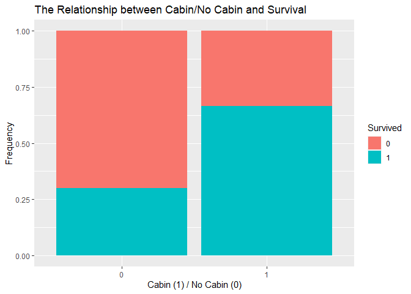<!-- -->

### 4. Factoring the categorical variables

```r
var_catg <- c("Survived","Pclass","Sex","Embarked", "Title", "CabinLevel")

for (i in var_catg){
  Titanic.full[,i] <- as.factor(Titanic.full[,i])
}

str(Titanic.full)
```

```
## 'data.frame':	1309 obs. of  15 variables:
##  $ PassengerId: int  1 2 3 4 5 6 7 8 9 10 ...
##  $ Survived   : Factor w/ 2 levels "0","1": 1 2 2 2 1 1 1 1 2 2 ...
##  $ Pclass     : Factor w/ 3 levels "1","2","3": 3 1 3 1 3 3 1 3 3 2 ...
##  $ Name       : chr  "Braund, Mr. Owen Harris" "Cumings, Mrs. John Bradley (Florence Briggs Thayer)" "Heikkinen, Miss. Laina" "Futrelle, Mrs. Jacques Heath (Lily May Peel)" ...
##  $ Sex        : Factor w/ 2 levels "female","male": 2 1 1 1 2 2 2 2 1 1 ...
##  $ Age        : num  22 38 26 35 35 30 54 2 27 14 ...
##  $ SibSp      : int  1 1 0 1 0 0 0 3 0 1 ...
##  $ Parch      : int  0 0 0 0 0 0 0 1 2 0 ...
##  $ Ticket     : chr  "A/5 21171" "PC 17599" "STON/O2. 3101282" "113803" ...
##  $ Fare       : num  7.25 71.28 7.92 53.1 8.05 ...
##  $ Cabin      : chr  "" "C85" "" "C123" ...
##  $ Embarked   : Factor w/ 3 levels "C","Q","S": 3 1 3 3 3 2 3 3 3 1 ...
##  $ Title      : Factor w/ 5 levels "Girl","Master",..: 4 5 3 5 4 4 4 2 5 1 ...
##  $ Surname    : chr  "Braund" "Cumings" "Heikkinen" "Futrelle" ...
##  $ CabinLevel : Factor w/ 2 levels "0","1": 1 2 1 2 1 1 2 1 1 1 ...
```

## Exploratory Data Analysis (EDA) {#step4}

```r
Titanic.full[1:891,] %>%
  group_by(Survived, Sex) %>%
  count() %>%
  pivot_wider(
    names_from = Survived,
    values_from = n,
  )
```

```
## # A tibble: 2 x 3
## # Groups:   Sex [2]
##   Sex      `0`   `1`
##   <fct>  <int> <int>
## 1 female    81   233
## 2 male     468   109
```

```r
ggplot(Titanic.full[1:891,], aes(x = Sex, fill = Survived)) +
         geom_bar(position = "fill") +
         ggtitle("The Relationship between Sex and Survival") +
         ylab("Frequency")
```

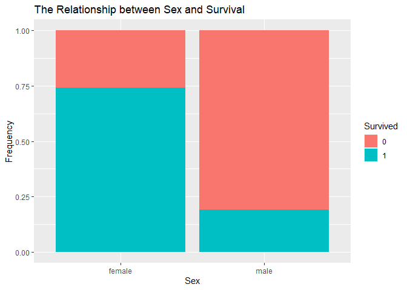<!-- -->

```r
Titanic.full[1:891,] %>%
  group_by(Survived, Pclass) %>%
  count() %>%
    pivot_wider(
    names_from = Survived,
    values_from = n,
  )
```

```
## # A tibble: 3 x 3
## # Groups:   Pclass [3]
##   Pclass   `0`   `1`
##   <fct>  <int> <int>
## 1 1         80   136
## 2 2         97    87
## 3 3        372   119
```

```r
ggplot(Titanic.full[1:891,], aes(x = Pclass, fill = Survived)) +
         geom_bar(position = "fill") +
         ggtitle("The Relationship between Pclass and Survival") +
         ylab("Frequency")
```

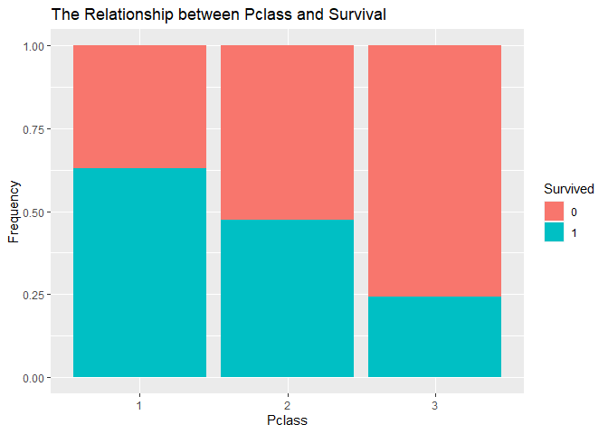<!-- -->

```r
ggplot(Titanic.full[1:891,], aes(x = Pclass, fill = Survived)) +
         geom_bar(position = "fill") +
         facet_wrap(~ Sex) +
         ggtitle("The Relationship between Pclass and Survival by Gender") +
         ylab("Frequency")
```

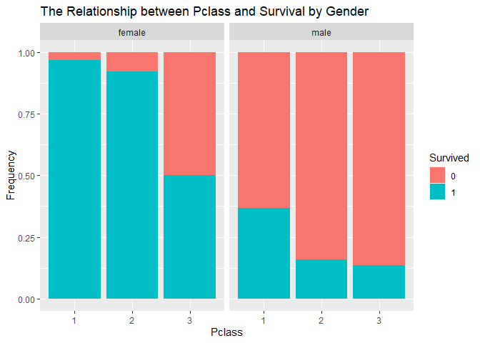<!-- -->

```r
Titanic.full[1:891,] %>%
  group_by(Survived, Embarked) %>%
  count() %>%
    pivot_wider(
    names_from = Survived,
    values_from = n,
  )
```

```
## # A tibble: 3 x 3
## # Groups:   Embarked [3]
##   Embarked   `0`   `1`
##   <fct>    <int> <int>
## 1 C           75    93
## 2 Q           47    30
## 3 S          427   219
```

```r
ggplot(Titanic.full[1:891,], aes(x = Embarked, fill = Survived)) +
         geom_bar(position = "fill") +
         ggtitle("The Relationship between Embarked and Survival") +
         ylab("Frequency")
```

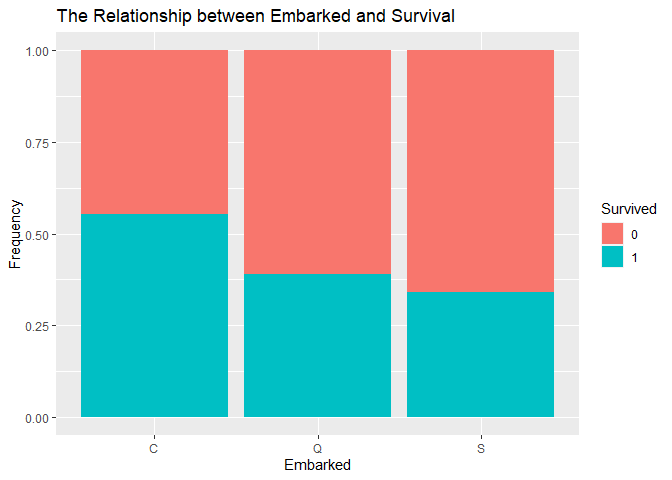<!-- -->

```r
ggplot(Titanic.full[1:891,], aes(x = Embarked, fill = Survived)) +
         geom_bar(position = "fill") +
         facet_wrap(~ Sex) +
         ggtitle("The Relationship between Embarked and Survival by Gender") +
         ylab("Frequency")
```

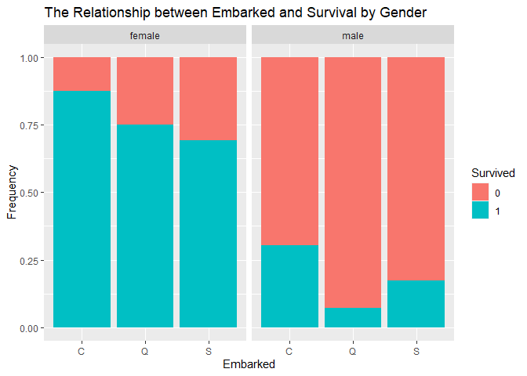<!-- -->

```r
ggplot(Titanic.full[1:891,], aes(x = Age, fill = Survived)) +
         geom_histogram() +
         ggtitle("The Relationship between Age and Survival")
```

```
## `stat_bin()` using `bins = 30`. Pick better value with `binwidth`.
```

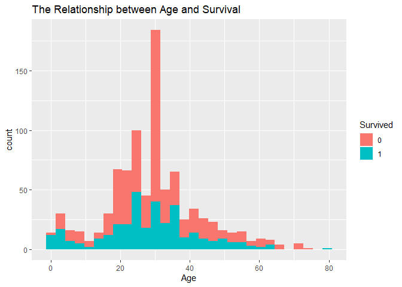<!-- -->

```r
ggplot(Titanic.full[1:891,], aes(x = Parch, fill = Survived)) +
         geom_bar(binwidth =1, position = "fill") +
         ggtitle("The Relationship between Parch and Survival") +
         ylab("Frequency")
```

```
## Warning: Ignoring unknown parameters: binwidth
```

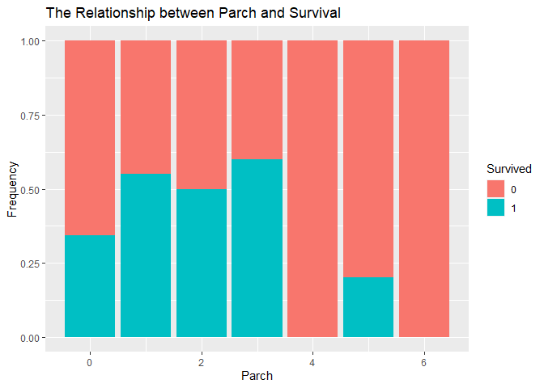<!-- -->

```r
ggplot(Titanic.full[1:891,], aes(x = SibSp, fill = Survived)) +
         geom_bar(binwidth =1, position = "fill") +
         ggtitle("The Relationship between Sibsp and Survival") +
         ylab("Frequency")
```

```
## Warning: Ignoring unknown parameters: binwidth
```

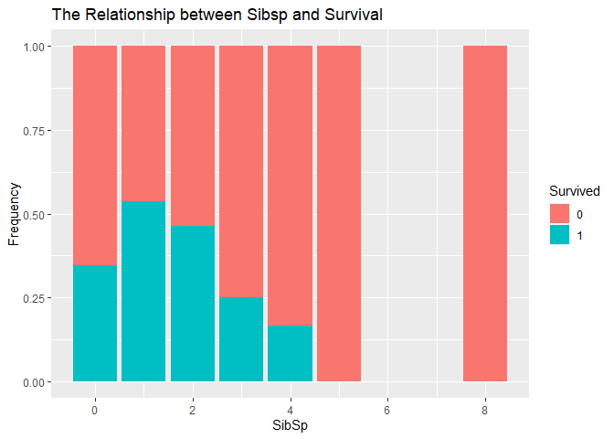<!-- -->

```r
ggplot(Titanic.full[1:891,], aes(x = Fare, fill = Survived)) +
         geom_histogram(position = "fill") +
         ggtitle("The Relationship between Fare and Survival") +
         ylab("Frequency")
```

```
## `stat_bin()` using `bins = 30`. Pick better value with `binwidth`.
```

```
## Warning: Removed 30 rows containing missing values (geom_bar).
```

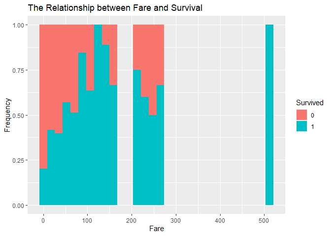<!-- -->

```r
ggplot(Titanic.full[1:891,], aes(x = Title, fill = Survived)) +
         geom_bar(position = "fill") +
         ggtitle("The Relationship between Title and Survival") +
         ylab("Frequency")
```

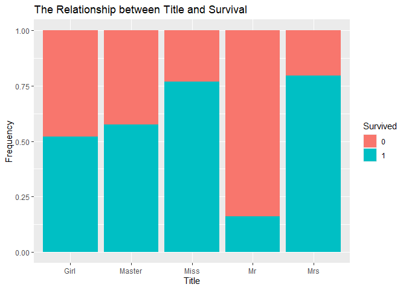<!-- -->

## Feature Engeneering {#step5}

```r
# Age
summary(Titanic.full$Age)
```

```
##    Min. 1st Qu.  Median    Mean 3rd Qu.    Max. 
##    0.17   22.00   30.00   29.49   36.00   80.00
```

```r
Titanic.full$AgeRange <- cut(Titanic.full$Age, c(0.17, 5, 15, 25, 35, 45, 55, 80), include.lowest = TRUE)

Titanic.full %>%
  select(AgeRange, Survived) %>%
  group_by(AgeRange) %>%
  count()
```

```
## # A tibble: 7 x 2
## # Groups:   AgeRange [7]
##   AgeRange     n
##   <fct>    <int>
## 1 [0.17,5]    74
## 2 (5,15]      59
## 3 (15,25]    369
## 4 (25,35]    458
## 5 (35,45]    194
## 6 (45,55]     96
## 7 (55,80]     59
```

```r
ggplot(Titanic.full[1:891,], aes(x = AgeRange, fill = Survived)) +
         geom_bar(position = "fill") +
         ggtitle("The Relationship between AgeRange and Survival") +
         ylab("Frequency")
```

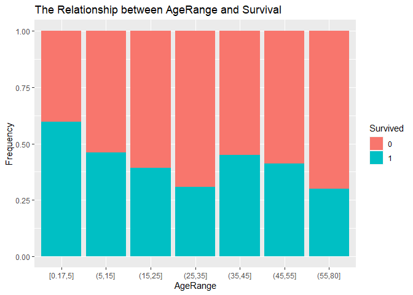<!-- -->

```r
# Fare
summary(Titanic.full$Fare)
```

```
##    Min. 1st Qu.  Median    Mean 3rd Qu.    Max. 
##   0.000   7.896  14.454  33.276  31.275 512.329
```

```r
Titanic.full$FareRange <- cut(Titanic.full$Fare, c(0, 8, 12, 21, 41, 513), include.lowest = TRUE)

Titanic.full %>%
  select(AgeRange, Survived) %>%
  group_by(AgeRange) %>%
  count()
```

```
## # A tibble: 7 x 2
## # Groups:   AgeRange [7]
##   AgeRange     n
##   <fct>    <int>
## 1 [0.17,5]    74
## 2 (5,15]      59
## 3 (15,25]    369
## 4 (25,35]    458
## 5 (35,45]    194
## 6 (45,55]     96
## 7 (55,80]     59
```

```r
ggplot(Titanic.full[1:891,], aes(x = FareRange, fill = Survived)) +
         geom_bar(position = "fill") +
         ggtitle("The Relationship between FareRange and Survival") +
         ylab("Frequency")
```

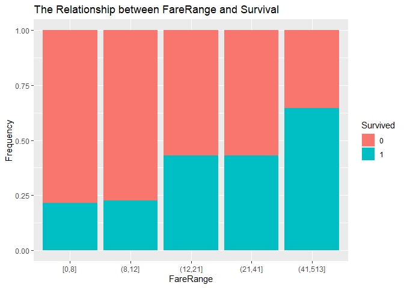<!-- -->

```r
# FamilySize
Titanic.full$FamilySize <- Titanic.full$SibSp + Titanic.full$Parch + 1
table(Titanic.full$FamilySize)
```

```
## 
##   1   2   3   4   5   6   7   8  11 
## 790 235 159  43  22  25  16   8  11
```

```r
Titanic.full$Family[Titanic.full$FamilySize == 1] <- "Small"
Titanic.full$Family[Titanic.full$FamilySize %in% c(2, 3, 4)] <- "Medium"
Titanic.full$Family[Titanic.full$FamilySize %in% c(5, 6, 7, 8, 11)] <- "Large"

ggplot(Titanic.full[1:891,], aes(x = Family, fill = Survived)) +
         geom_bar(position = "fill") +
         ggtitle("The Relationship between Family and Survival") +
         ylab("Frequency")
```

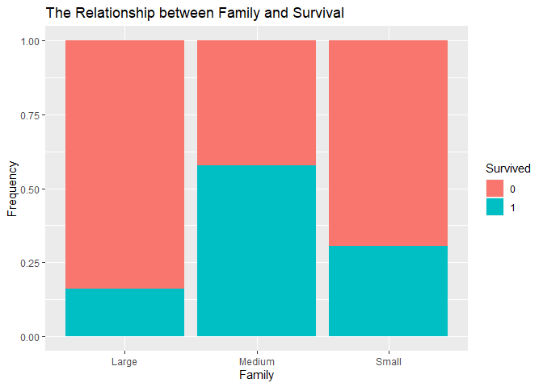<!-- -->

```r
var_catg2 <- c("AgeRange","FareRange","Family")

for (i in var_catg2){
  Titanic.full[,i] <- as.factor(Titanic.full[,i])
}

str(Titanic.full)
```

```
## 'data.frame':	1309 obs. of  19 variables:
##  $ PassengerId: int  1 2 3 4 5 6 7 8 9 10 ...
##  $ Survived   : Factor w/ 2 levels "0","1": 1 2 2 2 1 1 1 1 2 2 ...
##  $ Pclass     : Factor w/ 3 levels "1","2","3": 3 1 3 1 3 3 1 3 3 2 ...
##  $ Name       : chr  "Braund, Mr. Owen Harris" "Cumings, Mrs. John Bradley (Florence Briggs Thayer)" "Heikkinen, Miss. Laina" "Futrelle, Mrs. Jacques Heath (Lily May Peel)" ...
##  $ Sex        : Factor w/ 2 levels "female","male": 2 1 1 1 2 2 2 2 1 1 ...
##  $ Age        : num  22 38 26 35 35 30 54 2 27 14 ...
##  $ SibSp      : int  1 1 0 1 0 0 0 3 0 1 ...
##  $ Parch      : int  0 0 0 0 0 0 0 1 2 0 ...
##  $ Ticket     : chr  "A/5 21171" "PC 17599" "STON/O2. 3101282" "113803" ...
##  $ Fare       : num  7.25 71.28 7.92 53.1 8.05 ...
##  $ Cabin      : chr  "" "C85" "" "C123" ...
##  $ Embarked   : Factor w/ 3 levels "C","Q","S": 3 1 3 3 3 2 3 3 3 1 ...
##  $ Title      : Factor w/ 5 levels "Girl","Master",..: 4 5 3 5 4 4 4 2 5 1 ...
##  $ Surname    : chr  "Braund" "Cumings" "Heikkinen" "Futrelle" ...
##  $ CabinLevel : Factor w/ 2 levels "0","1": 1 2 1 2 1 1 2 1 1 1 ...
##  $ AgeRange   : Factor w/ 7 levels "[0.17,5]","(5,15]",..: 3 5 4 4 4 4 6 1 4 2 ...
##  $ FareRange  : Factor w/ 5 levels "[0,8]","(8,12]",..: 1 5 1 5 2 2 5 4 2 4 ...
##  $ FamilySize : num  2 2 1 2 1 1 1 5 3 2 ...
##  $ Family     : Factor w/ 3 levels "Large","Medium",..: 2 2 3 2 3 3 3 1 2 2 ...
```

## Building Models {#step6}

```r
model_rf <- randomForest(Survived ~ Pclass + Sex + Age + SibSp + Parch + Fare + Embarked + Title + CabinLevel + AgeRange + FareRange + Family, ntree = 5000, data = Titanic.full[1:891, ], importance = TRUE)

importance(model_rf)
```

```
##                    0        1 MeanDecreaseAccuracy MeanDecreaseGini
## Pclass     49.263602 80.01202             92.04982        25.224071
## Sex        70.641317 67.09602             73.84816        50.794694
## Age        49.573787 55.69392             76.80660        43.229636
## SibSp      34.890285 13.84419             39.13441        11.931043
## Parch       6.192113 15.57032             14.66113         7.813195
## Fare       47.475808 67.50359             83.91295        52.194470
## Embarked   18.506756 47.75694             49.09331        10.397629
## Title      86.041588 91.87745             95.61436        74.131223
## CabinLevel 44.981870 23.45014             54.94746        13.465544
## AgeRange   21.265361 52.51623             52.95584        19.316903
## FareRange  28.729199 50.41993             55.78562        18.126025
## Family     41.942157 39.03073             61.15959        16.081284
```

```r
varImpPlot(model_rf)
```

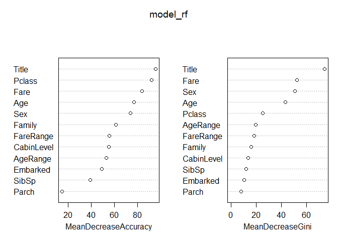<!-- -->

```r
model_rf1 <- randomForest(Survived ~ Pclass + Sex + Age + Fare + Embarked + Title + CabinLevel + AgeRange + FareRange + Family, ntree = 5000, data = Titanic.full[1:891, ], importance = TRUE)

model_rf2 <- randomForest(Survived ~ Pclass + Sex + Title, ntree = 5000, data = Titanic.full[1:891, ], importance = TRUE)

model_rf3 <- randomForest(Survived ~ Pclass + Fare + Title, ntree = 5000, data = Titanic.full[1:891, ], importance = TRUE)
```

## Predicting survival on the Titanic {#step7}

```r
# rf
predict <- predict(model_rf, newdata = Titanic.full[892:1309,])

pred.rf <- data.frame(PassengerId = Titanic.full[892:1309,]$PassengerId, Survived = predict)

write.csv(pred.rf, file = "Titanic_randomForest_final1.csv", row.names = F)

# rf1
predict <- predict(model_rf1, newdata = Titanic.full[892:1309,])

pred.rf <- data.frame(PassengerId = Titanic.full[892:1309,]$PassengerId, Survived = predict)

write.csv(pred.rf, file = "Titanic_randomForest_final2.csv", row.names = F)

# rf2
predict <- predict(model_rf2, newdata = Titanic.full[892:1309,])

pred.rf <- data.frame(PassengerId = Titanic.full[892:1309,]$PassengerId, Survived = predict)

write.csv(pred.rf, file = "Titanic_randomForest_final3.csv", row.names = F)

# rf3
predict <- predict(model_rf3, newdata = Titanic.full[892:1309,])

pred.rf <- data.frame(PassengerId = Titanic.full[892:1309,]$PassengerId, Survived = predict)

write.csv(pred.rf, file = "Titanic_randomForest_final4.csv", row.names = F)
```


